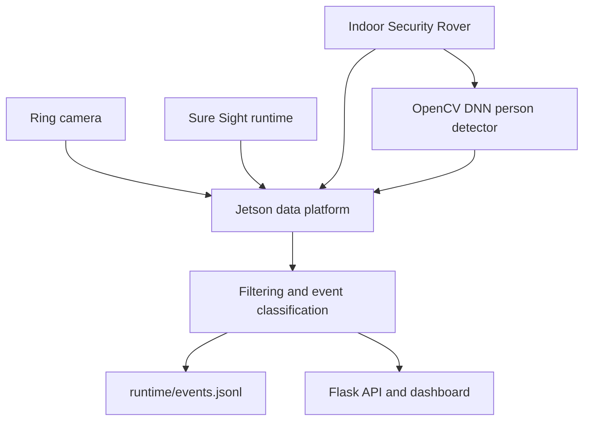

# AI Security Robot Data Platform

The AI Security Robot Data Platform is a Jetson-based integration layer that
collects, filters, stores, and presents operational data from multiple security
and robotic systems. The project brings the Sure Sight door-projection runtime,
Ring camera events, and Indoor Security Rover telemetry into one local
dashboard and one persistent event timeline.

This project demonstrates how I designed a real-time embedded data system
instead of treating each camera, sensor, and robot as an isolated device. The
platform receives network events from independent sources, processes rover
sensor readings, records meaningful state changes, and provides a common API
for reviewing system behavior.

## Current integration

- **Sure Sight runtime:** alert state, event ID, message, projector state, and
  remaining alert time from `http://127.0.0.1:5000/api/status`
- **Ring camera:** motion and on-demand events, event timestamps, answered
  state, Wi-Fi health, battery information when available, and the latest
  snapshot
- **Indoor Security Rover:** ultrasonic distance readings, rolling median
  filtering, proximity classification, and emergency/autonomous controls
- **AI person detection:** a quantized MediaPipe/OpenCV DNN model analyzes
  rover-camera frames, records person-detection events with confidence and
  inference time, and saves the latest annotated evidence frame
- **Camera dashboard:** fixed security-camera feed and rover-camera feed
- **Persistent storage:** combined JSON Lines event history in
  `runtime/events.jsonl`

## System architecture



The door projector remains dedicated to presenting the exterior view and active
security alerts. The data platform runs behind the scenes and records the
system's operation without cluttering the projected display.

## Data processing

Rover ultrasonic readings pass through a rolling five-sample median filter.
This reduces isolated sensor spikes before the platform classifies the reading:

- `CLEAR`: above 50 cm
- `CAUTION`: 26–50 cm
- `OBSTACLE`: 25 cm or less

Only proximity-state changes are written as events. Ring event IDs and Sure
Sight alert IDs are also tracked so repeated polling does not create duplicate
records.

## AI person detection

The AI path uses the block-quantized MediaPipe person-detection model published
by the OpenCV Zoo. It runs through OpenCV DNN on the Jetson and does not require
PyTorch or cloud inference. Install the model and its Apache-2.0 license into
the Git-ignored runtime directory:

```bash
source .venv/bin/activate
python scripts/setup_person_detector.py
```

Enable the detector when starting the platform:

```bash
AI_ENABLED=true \
AI_CAMERA_URL="http://192.168.1.251/capture" \
AI_SCORE_THRESHOLD=0.45 \
AI_POLL_SECONDS=5 \
AI_AUTOMATIC_STOP=false \
python -m app.main
```

When the model detects a person, the platform records an
`ai_person_detection` event in the shared JSON Lines timeline. Each event
contains the camera source, person count, model confidence, threshold,
inference time, action, and UTC timestamp. The dashboard shows current detector
state and the latest annotated frame. Repeated positive frames are condensed
into one event until the scene returns to a no-person state.

`AI_AUTOMATIC_STOP` is deliberately disabled by default. When enabled after
motion testing, a new detection also sends the rover's stop command and records
that action in the event.

This model detects whether a person is present; it does not identify faces or
retain facial identities. The annotated snapshot is overwritten by the next
detection and remains inside the excluded `runtime/` directory.

## Run

```bash
cd ~/ai-security-robot-data-platform
source .venv/bin/activate

RING_ENABLED=true \
RING_DEVICE_NAME="Front Door" \
python -m app.main
```

Open:

```text
http://JETSON_IP:5050/
```

The Ring authentication token is created locally with:

```bash
python scripts/ring_auth.py
```

Credentials and tokens are stored under `runtime/`, which is excluded from Git.

## API endpoints

| Endpoint | Purpose |
|---|---|
| `GET /api/health` | Combined platform and connection status |
| `GET /api/events` | Persisted Ring, Sure Sight, and rover timeline |
| `GET /api/ring/status` | Ring connection and device health |
| `GET /api/ring/events` | Ring events collected during the current run |
| `GET /api/ring/snapshot` | Latest available Ring snapshot |
| `GET /api/sure-sight/status` | Current Sure Sight alert/projector state |
| `GET /api/sure-sight/events` | Sure Sight alerts collected during the current run |
| `GET /api/ai/status` | AI model, camera, detection, confidence, and action status |
| `GET /api/ai/events` | Person detections collected during the current run |
| `GET /api/ai/snapshot` | Latest annotated person-detection frame |
| `GET /api/rover/distance` | Raw and filtered rover distance data |
| `POST /api/rover/stop` | Emergency rover stop |
| `POST /api/rover/autonomous` | Confirmed autonomous-mode start |

Use `?limit=NUMBER` with `/api/events` to request between 1 and 500 recent
records.

## Verified result

The final integration test confirmed that:

- Ring and Sure Sight collectors connected simultaneously.
- A live Sure Sight alert was recorded within the one-second polling interval.
- Ring motion and on-demand events remained available after a platform restart.
- The persistent timeline recovered 61 existing records from all three sources.
- Historical rover events were normalized to the `rover` source.
- The live rover camera detected one person at `0.682` confidence in `56.51 ms`;
  an empty Sure Sight frame returned zero detections.
- Python compilation completed without errors.

## Hardware and software

- NVIDIA Jetson Orin Nano
- Sure Sight door-projection security runtime
- Ring front-door camera used as the current demonstration/data source
- ELEGOO Smart Robot Car V4.0
- ESP32 camera and TCP-to-Uno bridge
- Python 3, Flask, OpenCV DNN, NumPy, `ring-doorbell`, and PySerial

## Scope note

Ring is used as the current demonstration and data source. It is not presented
as the final production camera architecture for Sure Sight. The intended
production path remains a locally controlled camera connected to the embedded
system, preserving the project's edge-first and privacy-focused design.

Runtime logs, Ring tokens, snapshots, and local backups are intentionally
excluded from the public repository.
